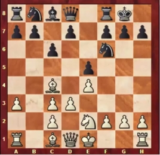
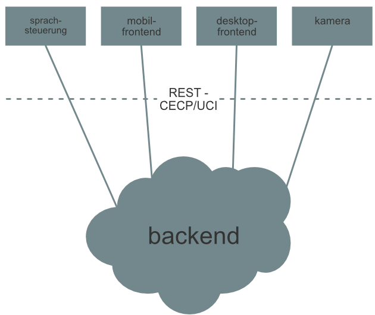

# Anforderungs- und Entwurfsspezifikation ("Pflichtenheft")

## Deep Green - Another Chess Game

### Beteiligte Autoren

* Tobias Koppmann
 
## 1 Einführung

### 1.1 Beschreibung

Deep Green - Another Chess Game

Die Software "Deep Green" lässt das klassische Schachspiel wieder aufleben.
Dabei macht die Software es möglich, gegen menschliche und KI-Gegner anzutreten.
Neben dem einfach zugänglichen schnellen Spiel, existiert auch eine Möglichkeit, über ein Benutzersystem erweiterte Funktionen zu nutzen.
Zu den erweiterten Funktionen gehören zum Beispiel das speichern von Spielen, der Eintrag in einer Rangliste und die Nutzung eines Matchmaking-Systems bei der suche nach Online-Gegenspielern.
Zusätzlich gibt es die Möglichkeit an Spielen als Zuschauer teilzunehmen.
Unter Nutzung einer Cloud-Infrastruktur ist es möglich auf zahlreichen Endgeräten und zu jeder Zeit gegeneinander zu spielen.
Unter anderem wird dabei neben visuellen Ein-/Ausgabegeräten auch Sprachein-/ausgabe für das Spiel mit dem eigenen, klassischen Spielbrett bereit gestellt.
Die Übernahme einer definierten Spielsituation von einem realen Spielbrett, ist mit Hilfe eines Foto-Uploads und darauf angewendeter Bilderkennung möglich.

### 1.2 Ziele

    - Anwendungsbereiche, Motivation, Umfang, Marktanforderungen, Alleinstellungsmerkmale
    - Informationen zu Zielbenutzergruppen und deren Merkmale (Bildung, Erfahrung, Sachkenntnis)
    - Abgrenzung (Was ist das Softwaresystem _nicht_)

## 2 Anforderungen

### 2.1 Funktionale Anforderungen

    - Use-Case Diagramme

* Benutzer kann Schach spielen
* Gegen Menschen spielbar
* Gegen KI spielbar
* Über Desktop spielbar
* Über Smartphone spielbar
* Über Voice Assistant spielbar
* Benutzer kann sich registrieren
* Als Gast spielbar

### 2.2 Nicht-funktionale Anforderungen

* Kamera kann initiale Spielsituation erstellen
* Benutzer kann Spielen zusehen

#### 2.2.1 Rahmenbedingungen

    - Normen, Standards, Protokolle, Hardware, externe Vorgaben

#### 2.2.2 Betriebsbedingungen

    - Vorgaben des Kunden (z.B. Web Browser / Betriebssystem Versionen, Programmiersprache)

#### 2.2.3 Qualitätsmerkmale

    - Externe Qualitätsanforderungen (z.B. Performance, Sicherheit, Zuverlässigkeit, Benutzerfreundlichkeit)

### 2.3 Graphische Benutzerschnittstelle

#### Desktop

#### Mobil

### 2.4 Anforderungen im Detail

    - User Stories mit Akzeptanzkritierien 
    - Optional: Name (oder ID) und Priorität ("Muss", "Soll", "Kann")

#### Frontend

| **Name**| **Als**...|   ...**möchte ich**...   | ..., **sodass**... | **erfüllt wenn**... | **Priorität**   |
|:-----|:----------:|:-------------------|:-------------|:---------|:----------------
| Spiel starten | Spieler | ein neues Spiel starten können | um das Spiel zu spielen | ich auf dem Spielbrett bin und einen Gegenspieler habe | Must
| Spiel laden | Spieler | ein Spiel laden können | ich es fortsetzen kann | ich das gleiche Spielfeld habe, wie es gespeichert wurde | Must
| Spiel speichern | Spieler | ein Spiel speichern können | ich es zu einem anderen Zeitpunkt fortsetzen kann | der Speicherstand erstellt ist | Must
| Spielzug | Spieler | Spielfiguren bewegen können | ich meinen Spielzug tätige | die gewählte Spielfigur auf einem neuen Feld steht | Must
| Spieler Reihenfolge | Spieler | sehen können, welcher Spieler am Zug ist | ich weiß, wann ich meinen Spielzug tätigen muss | ein Indikator anzeigt, welcher Spieler dran ist | Must
| Spiel aufgeben | Spieler | aufgeben können | ich das Spiel frühzeitig beenden kann | das Spiel als verloren und abgeschlossen gilt | Can
| Spielzug rückgängig | Spieler | Spielzüge gegen die KI rückgängig machen können | ich Fehler beheben und daraus lernen kann | sowohl der Spielzug des Spielers als auch der KI rückgängig gemacht wurde | Can
| Spielfigur austauschen | Spieler | die Bauer-Spielfigur gegen eine andere tauschen, wenn der Bauer die andere Seite des Spielbrettes erreicht | die Regel eingehalten wird | der Bauer eine neue Spielfigur ist und wie diese behandelt wird | Must
| Farbe wählen | Spieler | beim Spielen gegen die KI und zu Beginn des Spiels die Farbe der Spielfiguren wählen können | Spielsituationen üben kann | der Spieler die ausgewählte Farbe (Schwarz oder Weiß) spielt | Can
|Registrieren| User | mich registrieren können | das Matchmaking System nutzen kann | der User angelegt ist und er sich einloggen kann | Must
| Gastkonto | User | ein Gastkonto haben | ich ohne Registrierung gegen andere Spieler spielen kann | der User ein Gastkonto mit temporärem Namen hat | Must
| Zuschauen | User | einem Spiel zuschauen können |  ich selbst entscheide, was ich sehen kann | der Zuschauermodus geladen wurde und das Spielgeschehen angezeigt wird | Can

#### Bilderkennung

| **Name**| **Als**...|   ...**möchte ich**...   | ..., **sodass**... | **erfüllt wenn**... | **Priorität**   |
|:-----|:----------:|:-------------------|:-------------|:---------|:----------------
| Erkennung  |Spieler| dass aus einer Fotografie eines realen Schach- oder Damespiels zuverlässig die Spielsituation erkannt wird|ich ohne umfangreiche Korrekturen mit dem Spiel fortfahren kann| nach der Übertragung des Bildes die erkannte Spielsituation möglichst korrekt und verständlich (siehe Bild 'Schachnotation') dargestellt wird | Must
| Fehler  |Spieler| dass ich bei Unklarheiten bezüglich der Spielerkennung aus einer Fotografie deutlich darauf hingewiesen werde|damit ich sofort eventuelle Korrekturen vornehmen kann| nicht oder unklare Figuren in der erkannten Situation kenntlich gemacht werden | Must
| Korrektur  |Spieler| dass die Korrektur einer erkannten Spielsituation leicht möglich ist|damit ich sofort darauf reagieren kann| eine einfache Korrektur der erkannten Situation leicht möglich ist | Must

#### Backend

| **Name**| **Als**...|   ...**möchte ich**...   | ..., **sodass**... | **erfüllt wenn**... | **Priorität**   |
|:-----|:----------:|:-------------------|:-------------|:---------|:----------------
|Zug prüfen|Spieler|meine Züge auf Korrektheit geprüft werden|die Spielregeln des Spiels eingehalten werden|die Züge korrekt auf Gültigkeit geprüft werden| Must
|Spielende prüfen|Spieler|die Spielsituation bewertet|das Ende des Spiels (Gewinn/Verlust) erkannt wird|das Spielende korrekt erkannt wird| Must
|Frontend-Kommunikation 1|Frontend|Nachrichten an das Backend senden und von diesem empfangen|das Backend die Eingaben der Spieler erkennt und weitergibt|eine stabile Schnittstelle implementiert ist| Must

#### Sprachsteuerung
| **Name**| **Als**... |   ...**möchte ich**...   | ..., **sodass**... | **erfüllt wenn**... | **Priorität**   |
|:-----|:----------:|:-------------------|:-------------|:---------|:----------------
| Spielzug ansagen | Spieler | durch eine Spracheingabe einen Spielzug machen | ich meinen Zug tätigen kann | mein Zug gemacht ist | Must
| Spielende ansagen | Spieler | durch eine Spracheingabe das Spiel beenden können | wieder im Hauptmenü bin | das Spiel beendet ist | Must
| Spielstart ansagen | Spieler | durch eine Spracheingabe ein Spiel starten können | eine Partie Schach spielen kann | ich in einer Schachpartie bin | Must
| Gegnertyp ansagen | Spieler | durch eine Spracheingabe beim Starten eines neuen Spieles wählen können, ob der Gegner eine KI oder ein Mensch ist | meinen Gegnertyp auswählen kann | ich eine Partie gegen den ausgewählten Gegnertyp spiele | Must
| Feedback durchsagen | Spieler | durch eine Sprachausgabe hören, ob mein Zug gültig ist | ich weiß, ob mein Zug beendet ist | ich Feedback über mein Spielzug durchgesagt bekomme | Must
| Gegenerzug durchsagen | Spieler | durch eine Sprachausgabe hören, welchen Zug der Gegner gemacht hat | ich weiß, dass ich an der Reihe bin | ich den Gegnerzug durchgesagt bekomme | Must
| Spielerzug durchhsagen | Spieler | durch eine Sprachausgabe hören, welcher Spieler am Zug ist | ich weiß, dass ich an der Reihe bin | eine Durchsage den Spielerzug bestimmt | Must
| Spielstart durchsagen | Spieler | durch eine Sprachausgabe hören, dass mein Spiel begonnen hat | das Spiel beginnen kann | eine Durchhsage den Spielstart bestimmt | Can
| Gewinner durchsagen | Spieler | durch eine Sprachausgabe hören, wer gewonnen hat | ich über den Ausgang den Spiels bescheid weiß | eine Durchsage den Gewinner bestimmt | Must

#### Künstliche Intelligenz

| **Name**| **Als**...|   ...**möchte ich**...   | ..., **sodass**... | **erfüllt wenn**... | **Priorität**   |
|:-----|:----------:|:-------------------|:-------------|:---------|:----------------
| Gegner | Spieler | gegen einen voll funktionstüchtigen KI-Gegner spielen können | ich mich im Spiel gegen die KI messen kann | eine vollständige Partie gegen die KI gespielt werden kann | Must
| Strategie | Spieler | gegen eine strategisch vorgehende KI spielen können | Spielsituationen entstehen, die auch gegen "echte" Spieler entstehen können | die Strategie der KI über Zufalls-Züge hinaus geht | Must
| Schwierigkeitsgrad | Spieler | die Stärke des KI-Gegners einstellen können | ich die KI an meine Fähigkeiten anpassen kann | drei Schwierigkeitsgrade (Leicht, Mittel, Schwer) existieren | Must
| Schwierigkeitsgrad während eines Spiels | Spieler | während einer Partie gegen die KI den Schwierigkeitsgrad anpassen können | ich, wenn mir die KI zu stark ist, keine neue Partie anfangen muss um den Schwierigkeitsgrad zu verändern | während einer Partie eine Möglichkeit besteht die Schwierigkeit des KI-Gegners zu verändern | Can
| Gegner wechseln | Spieler | eine Partie gegen die KI speichern können | ich die Partie zu einem anderen Zeitpunkt gegen einen "echten" Gegner weiterspielen kann | bei einer gespeicherten Partie das Gegenüber von KI zu "echtem" Gegner gewechselt werden kann | Should

## 3 Technische Beschreibung

### 3.1 Systemübersicht

    - Systemarchitekturdiagramm ("Box-And-Arrow" Diagramm)
    - Schnittstellenbeschreibung
    - Kommunikationsprotokolle, Datenformate

### 3.2 Softwarearchitektur

    - Darstellung von Softwarebausteinen (Module, Schichten, Komponenten)

### 3.3 Datenmodell

    - Konzeptionelles Analyseklassendiagramm

### 3.4 Abläufe

    - Aktivitätsdiagramme für relevante Use Cases
    - Aktivitätsdiagramm für den Ablauf sämtlicher Use Cases

### 3.5 Entwurf

    - Detaillierte UML-Diagramme für relevante Softwarebausteine

## 4 Projektorganisation

### 4.1 Annahmen

    - Nicht durch den Kunden definierte spezifische Annahmen, Anforderungen und Abhängigkeiten
    - Verwendete Technologien (Programmiersprache, Frameworks, etc.)
    - Einschränkungen, Betriebsbedingungen und Faktoren, die die Entwicklung beeinflussen (Betriebssysteme, Entwicklungsumgebung)
    - Interne Qualitätsanforderungen (z.B. Softwarequalitätsmerkmale wie z.B. Erweiterbarkeit)

### 4.2 Verantwortlichkeiten

    - Zuordnung von Personen zu Softwarebausteinen aus Kapitel 3.1 und 3.2
    - Rollendefinition und Zuordnung

### 4.3 Grober Projektplan

    - Meilensteine

## 5 Anhänge

### 5.1 Glossar

    - Definitionen, Abkürzungen, Begriffe

### 5.2 Referenzen

    - Handbücher, Gesetze

### 5.3 Index
