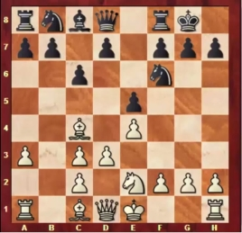

# Pflichtenheft

## textliche Anforderungsanalyse

### Beschreibung

- Mit Hilfe von Deep Green kann man Brettspiele (z.B. Schach, Dame etc.) konfigurieren und ausführen und als Spieler oder Zuschauer teilnehmen.
- Es ist möglich, sowohl gegen einen realen Spieler, als auch gegen eine KI zu spielen.
- Die Bedienung des Spiels ist über diverse Eingabegeräte (Smartphones, Desktop-PCs, Spracheingabe z.B. Google Home) möglich.
- Die initiale Spielsituation auf den Spielflächen kann über Kamera eingelesen werden.
- Die Darstellung für die Spieler und Zuschauer des Spiels findet sowohl über Display-Geräte (das umfasst auch VR), als auch über Audio statt.
- Es gibt die Möglichkeit, Zuschauer zuzulassen, bzw. als Zuschauer ein Spiel zu beobachten.
- Es gibt die Möglichkeit, sich zu registrieren oder als Gastspieler an einem Spiel teilzunehmen.
- Für registrierte Spieler gibt es ein System, das gleichstarke Spieler gegeneinander spielen lässt.

## User-Stories

### Frontend

| **Name**| **Als**...|   ...**möchte ich**...   | ..., **sodass**... | **erfüllt wenn**... | **Priorität**   |
|:-----|:----------:|:-------------------|:-------------|:---------|:----------------
| Bilderkennung - Erkennung  |Spieler| dass aus einer Fotografie eines realen Schach- oder Damespiels zuverlässig die Spielsituation erkannt wird|ich ohne umfangreiche Korrekturen mit dem Spiel fortfahren kann| nach der Übertragung des Bildes die erkannte Spielsituation möglichst korrekt und verständlich (siehe Bild 'Schachnotation') dargestellt wird | Must
| Bilderkennung - Fehler  |Spieler| dass ich bei Unklarheiten bezüglich der Spielerkennung aus einer Fotografie deutlich darauf hingewiesen werde|damit ich sofort eventuelle Korrekturen vornehmen kann| nicht oder unklare Figuren in der erkannten Situation kenntlich gemacht werden | Must
| Bilderkennung - Korrektur  |Spieler| dass die Korrektur einer erkannten Spielsituation leicht möglich ist|damit ich sofort darauf reagieren kann| eine einfache Korrektur der erkannten Situation leicht möglich ist | Must

### Backend

